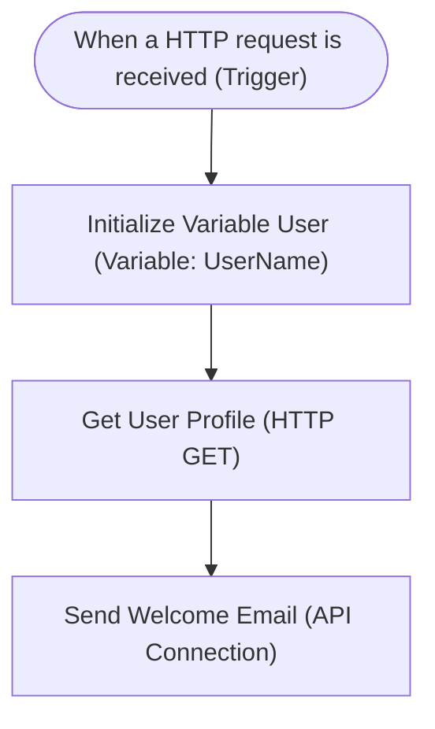
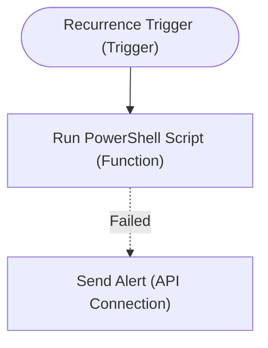

# Logic App to Mermaid.js Flowchart Parser

A lightweight, mostly vibe coded, PowerShell tool designed to parse Azure Logic App definitions (raw JSON code views, JavaScript-wrapped definitions, or ARM deployment templates) and automatically compile them into beautifully structured, color-coded **Mermaid.js** flowcharts.

This tool is optimized for direct integration with **Excalidraw** (which allows importing Mermaid flowcharts into editable canvas elements), Mermaid Live Editor, and standard Markdown documents.

---

## 🌟 Key Features

*   **Multi-Source Extraction**: Parses and extracts workflow definitions directly from:
    *   **Raw JSON**: Standard Logic App `definition` JSON structures or properties resource envelopes.
    *   **JavaScript Wrappers**: Extracts JSON definitions even if assigned to a Javascript variable (e.g., `const workflow = { ... };`).
    *   **ARM Templates**: Scans the `resources` array for `Microsoft.Logic/workflows` resource types. If multiple Logic Apps exist in a single deployment template, they are all parsed and grouped into gorgeous top-level subgraphs!
*   **Recursive Control structures**: Maps Logic App nesting hierarchies recursively. Native constructs like **Scopes**, **ForEach loops**, **Until loops**, **If conditions**, and **Switch blocks** are rendered as beautifully nested subgraphs.
*   **No Emojis, Clean Labeling**: Adheres to a professional, emoji-free layout. Actions are labeled with their friendly user-defined names, immediately followed by the default connector/action type in brackets (e.g. `Fetch Remote Data (HTTP GET)`, `Initialize Status (Variable: Status)`, `Send Alert (servicebus)`).
*   **Smart Link Routing & Error Paths**:
    *   Maps error-handling pathways! Actions configured to run after a failure are rendered as red dotted lines labeled with their transition status:
        *   `Run PowerShell Script -. Failed .-> Send Alert`
    *   Handles empty conditional branches! If an `else` branch of an `If` statement is empty, the parser automatically routes a bypass connection directly from the decision node to the next merge node, labeled `-- No -->`:
        *   `Check If Scope Succeeded -- No --> Send Final Report`
*   **Clipboard & Output Flexibility**: Writes directly to a file (`-OutputPath`) or copies the Mermaid code directly to your clipboard (`-Clipboard`) for immediate pasting into Excalidraw or a markdown editor.
*   **Aesthetic Styling Themes**: Automatically appends custom HSL pastel classes at the end of the diagram, color-coding triggers, standard actions, and loop/conditional controllers. Supports `default` pastel, `dark`, `forest`, and `neutral` styling themes.

---

## 🚀 Getting Started

### Prerequisites
*   Windows PowerShell 5.1 or PowerShell Core 7+.

### Installation
Clone this repository to your local system:
```bash
git clone https://github.com/your-username/LogicApp-to-Mermaid.git
cd LogicApp-to-Mermaid
```

---

## 🛠️ Usage Examples

All examples use the sample files located in the `\samples` folder of this repository.

### 1. Parse and copy to Clipboard (Perfect for Excalidraw)
Extract the workflow structure and immediately copy the Mermaid flowchart syntax to your clipboard:
```powershell
.\Parse-LogicApp.ps1 -Path ".\samples\simple.json" -Clipboard
```

### 2. Parse a complex loop/conditional workflow and save to a file
```powershell
.\Parse-LogicApp.ps1 -Path ".\samples\complex.json" -OutputPath ".\samples\complex.mmd" -Theme forest
```

### 3. Parse an ARM Template, output a Left-to-Right layout, and use Dark theme
```powershell
.\Parse-LogicApp.ps1 -Path ".\samples\arm.json" -OutputPath ".\samples\arm.mmd" -Direction LR -Theme dark
```

---

## ⚙️ Parameters Guide

| Parameter | Type | Required | Default | Description |
| :--- | :--- | :--- | :--- | :--- |
| `-Path` | `[string]` | **Yes** | — | Path to the input file (`.json`, `.txt`, `.js`) containing the workflow. |
| `-OutputPath` | `[string]` | No | — | Path where the compiled `.mmd` or `.txt` flowchart file should be saved. |
| `-Clipboard` | `[switch]` | No | `False` | Copies the compiled Mermaid syntax directly to the clipboard. |
| `-Direction` | `[string]` | No | `TD` | The direction of the flowchart. Options: `TD` (Top-Down), `LR` (Left-to-Right), `BU` (Bottom-Up), `RL` (Right-to-Left). |
| `-Theme` | `[string]` | No | `default` | The color theme definition. Options: `default` (Pastel HSL), `dark`, `forest`, `neutral`. |

---

## 🎨 Visual Mapping System

The parser maps action types into standard flow diagram shapes and category-brackets:

| Category | Action/Connector Types | Shape | Label Bracket | Example Output Node |
| :--- | :--- | :--- | :--- | :--- |
| **Triggers** | Request / HTTP Request / Recurrence | Stadium `([ ... ])` | `(Trigger)` | `When a HTTP request is received (Trigger)` |
| **HTTP Actions** | Http | Round Rect `[ ... ]` | `(HTTP [Method])` | `Get User Profile (HTTP GET)` |
| **Variables** | Initialize, Set, Increment, Append | Round Rect `[ ... ]` | `(Variable: [Name])` | `Initialize Status (Variable: Status)` |
| **Data Ops** | Compose | Round Rect `[ ... ]` | `(Compose)` | `Compose Data Summary (Compose)` |
| **SaaS APIs** | Office 365 Outlook, Teams, SharePoint | Round Rect `[ ... ]` | `([ManagedConnectorName])` | `Send Welcome Email (office365)` |
| **Compute** | Azure Functions | Round Rect `[ ... ]` | `(Function)` | `Run PowerShell Script (Function)` |
| **Scopes** | Scope | Subgraph `subgraph` | `(Scope)` | `Processing Scope (Scope)` |
| **Loops** | ForEach, Until | Subgraph + Double Rect `[[ ... ]]` | `(ForEach)` / `(Until)` | `Process Each Item (ForEach)` |
| **Conditionals**| If, Switch | Subgraph + Diamond `{ ... }` | `(If)` / `(Switch)` | `Check If Scope Succeeded (If)` |

---

## 🗺️ How to Import into Excalidraw

1.  Run the script with the `-Clipboard` flag to copy the diagram:
    ```powershell
    .\Parse-LogicApp.ps1 -Path ".\samples\complex.json" -Clipboard
    ```
2.  Open [Excalidraw](https://excalidraw.com/) in your web browser.
3.  Click on the **More tools** button (the three dots on the tool panel) and select **Mermaid** (or choose **Insert -> Mermaid** from the main menu).
4.  Paste your clipboard contents into the text box.
5.  Click **Insert** or **Render**!
6.  *Voila!* Excalidraw translates the Mermaid script into editable, draggable canvas elements. You can resize text boxes, edit names, move paths, and draw directly over the rendering.

---

## 📂 Sample Flowchart Outputs

### Simple Flowchart (Standard HSL theme)


### Complex Flowchart with Error-Handling & Nested Scopes


---

## 🤝 Contributing
Contributions, bug reports, and features are welcome! Feel free to open issues or submit pull requests.

## 📄 License
This project is licensed under the MIT License - see the `LICENSE` file for details.
